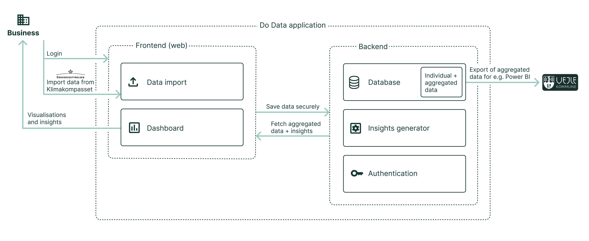

## Introduction
This project provides a web-based data visualization platform for the DoData project from Vejle municipality. It enables local development and testing of a data platform as well as a docker-based deployment setup and hosting setup. The essential features include:
- **Data import**:  
Imports data files exported from Klimakompasset.
- **Dashboard**:  
A web-based visualization dashboard.
- **Insights generator**:  
Generates insights and recommendations based on imported data.

## Overview


## Contents
- [Introduction](#Introduction)
- [Overview](#overview)
- [Main Components](#main-components)
  - [1. Pocketbase Backend](#1-pocketbase-backend)
    - [Technologies](#technologies)
    - [Key Features](#key-features)
    - [Description](#description)
    - [Setup Instructions](#setup-instructions)
  - [2. React Frontend](#2-react-frontend)
    - [Technologies](#technologies-1)
    - [Description](#description-1)
    - [Setup Instructions](#setup-instructions-1)
- [Development Workflow](#development-workflow)
    - [VSCode Devcontainer](#vscode-devcontainer)
    - [Docker Compose](#docker-compose)
- [Additional Guides](#additional-guides)
    - [User Guide](#user-guide)
    - [Administration Guide](#administration-guide)
    - [Hosting Guide](#hosting-guide)

## Main Components

### 1. Pocketbase Backend

#### Technologies:
- [Pocketbase](https://pocketbase.io/) (Embedded backend framework)
- Go (Golang)
- Docker (Hosting and deveopment environment)

#### Key Features:
- RESTful API for data access and management
- Database migrations for evolving schema (`migrations/` folder)
- Integrates with React frontend
- Authentication and superuser setup

#### Description:
The Pocketbase backend serves as the core data management service. It provides a RESTful API for data access and a dashboard for data-model management.

The backend files are located in the `pocketbase/do-data-go/` directory. It includes database migration scripts in the `migrations/` folder to manage schema changes over time.

**File structure:**
- `klimakompasset.go`: Specific logic for reading and parsing data files from Klimakompasset.
- `recommendations.go`: Logic for handling recommendation rules.
- `main.go`: Main pocketbase logic for setting up app and handling routes.

#### Setup Instructions:
- Dependencies:
  - Golang
- Start development server:
  ```
  cd pocketbase/do-data-go
  ./watch
  ```
- Build statically linked executable:
  ```
  cd pocketbase/do-data-go
  go build
  ```
- Accessible at: `http://localhost:8080/_/` with the default user: `admin@test.dk`/`admin1234`

### 2. React Frontend

#### Technologies:
- React (Frontend framework)
- TypeScript
- Vite (Build tool)
- Tailwind CSS
- Headless UI (Component library)

#### Description:
The React frontend provides the user interface for interacting with the DoData platform. It communicates with the Pocketbase backend via RESTful API calls. The frontend is located in the `frontend-app/` directory.

**File structure:**
- `src/main.tsx`: Entry point of the React application.
- `src/components/`: Contains reusable React components.
- `src/routes/`: Contains components for different routes.
- `src/hooks/`: Custom React hooks for data fetching and state management.

#### Setup Instructions:
- Dependencies:
  - Node.js
  - npm
- Install dependencies:
  ```
  cd frontend-app
  npm install
  ```
- Start development server:
  ```
  npm run dev
  ```
- Accessible at: `http://localhost:8000`

## Development Workflow
The project uses Docker Compose to orchestrate the services for easy setup and teardown during development.
It contains a `devcontainer.json` for VSCode devcontainer support, but can also be run directly with Docker Compose.

### VSCode Devcontainer
Open the project root folder in VSCode and reopen it in a devcontainer for a pre-configured development environment.

### Docker Compose
- Use Docker Compose to build and run all services:
  ```
  docker-compose up -d --build
  ```
- Stop services:
  ```
  docker compose down
  ```
- For development, connect to the `dev` container.

## Deployment

When deploying the solution use `go build` to create the executable for the Pocketbase backend, and `npm run build` build the static react frontend.

The backend can be served using the command: `./do-data-go serve yourdomain.com` and the frontend can be served using any static file server or the public folder of the Pocketbase backend.

Refer to [Pocketbase documentation](https://pocketbase.io/docs/going-to-production/) for more details on deployment and the [Vite documentation](https://vite.dev/guide/build) for more details on building the React frontend for production.

## Additional Guides
### [User guide](docs/user.md)    
### [Administration guide](docs/admin.md)

